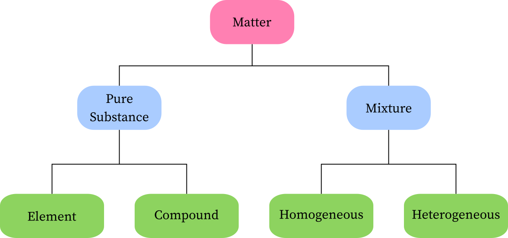
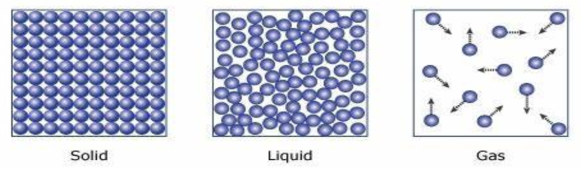

# Midterm Study Guide (2021-2022 School Year)

## What  is chemistry

the study of the properties and behavior of matter

## What is matter

matter is any substance that has mass and takes up space by having volume.

## Chemical vs. Physical Property

Physical Properties:

- Examples: Boiling point, Density, Mass, and Volume

Chemical Properties:

- Examples: Flammability, Corrosiveness, or Reactivity with acids

## Chemical vs. Physical Change

### Chemcial Change

- not easily reversed

- new products formed

- reactants used up
- often heat/light/sound/fizzing occurs
- electricity maye formed 
- precipitate may form

### Physical Change

- easily reversed
- no new sustance created
- often just a state change

## Pure Sustance vs. Mixture

There are two classfication under matter: mixture and substance.

> Mixture: a combination of more than one substance

> Substance: compound/element

## Homogenous Mixture vs. Heterogenous Mixture

Homogenous: one that is mixed/dissolved together, like saltwater

Heterogenous: a mixture of two or more substances that are not soluble with each other, like sand and water

## Three States of Matter

## Intensive Property & Extensive Property

 

> Intensive Property: a property that is a system of physical properties that does not depend on the size or amount of the system

- Examples: melting point, boiling point, etc.

> Extensive Property: a property that totally depends on the size or amount of the material (varies with a change of volume/amount)

- Examples: weight, mass, volume, etc.

## Unit  Conversion

skip

## Desity

Density = Mass / Volume         

$$d=\frac mv$$                   

## Atom

Atom: the smallest particle of a chemical element that can exist

## Molecular Compound && Ionic Compound

Molecular Compound: is formed by the reaction of two or more nonmetals
Ionic Compounds: formed by the reaction of a metal with a non-metal

## Naming

Naming Ionic Compounds: Find the charge of the cation and make it equal to the anion charge (the roman numerals) and add the suffix -ide to the end of the 2nd element

$ Cu_2O$→Copper(1)Oxide 

## Terms

### Ions

Cations: positively charged ions formed from neutral atoms (metal) (Left side on PT)

- Formed when an electron is lost

Anions: are the negatively charged ions formed from neutral atoms (nonmetal) (Right Side on PT)

- Formed when an electron is gained

### Groups and Periods
Groups: *the vertical columns *(down) the table
Periods: the horizontal rows (across) the periodic table

### Specific names 
Metals: located on the left side of the periodic table
Non-Metals: located on the right side of the periodic table (plus hydrogen)
Metalloids: located along the step formation on the right side of the periodic tableAlkali Metals: located along group one
Alkaline Earth Metals: located along group two
Halogens: located along group 17
Noble Gases: located along group 18 (the most stable elements and the least likely to react in a reaction)
